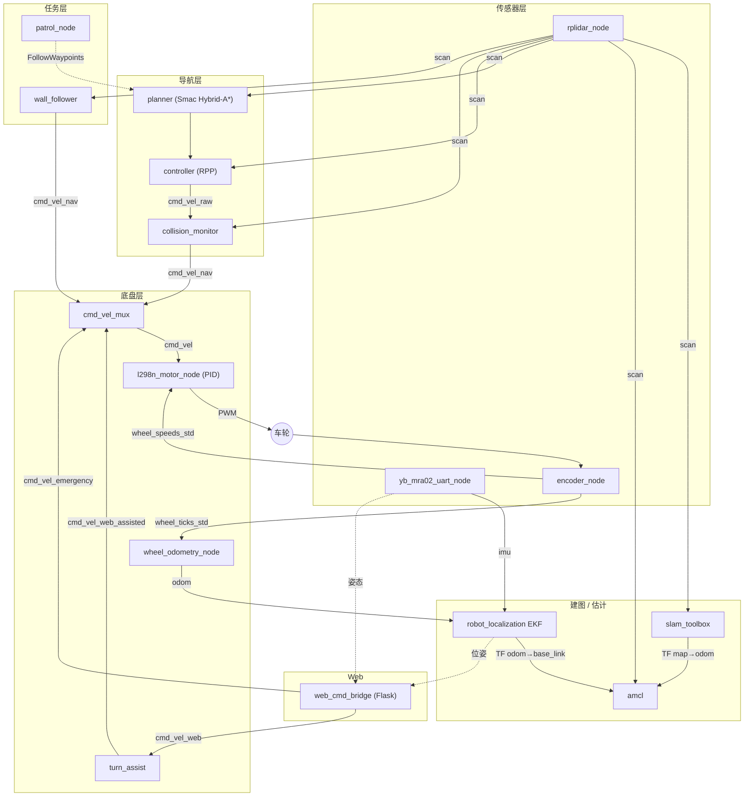
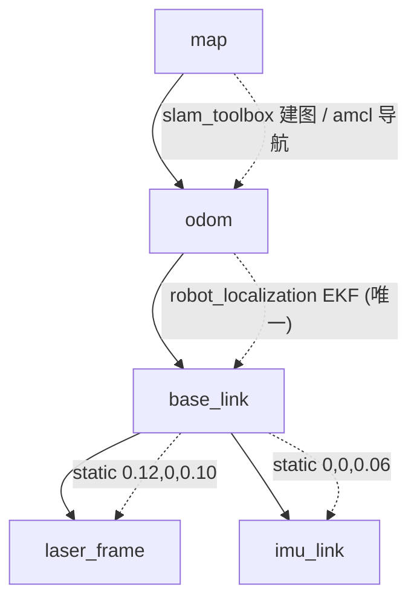
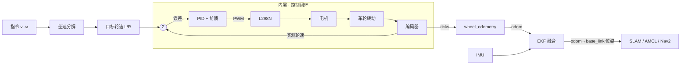
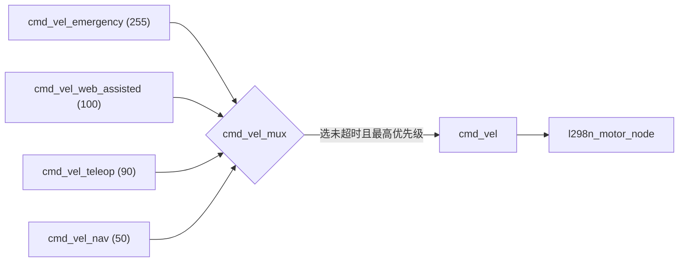
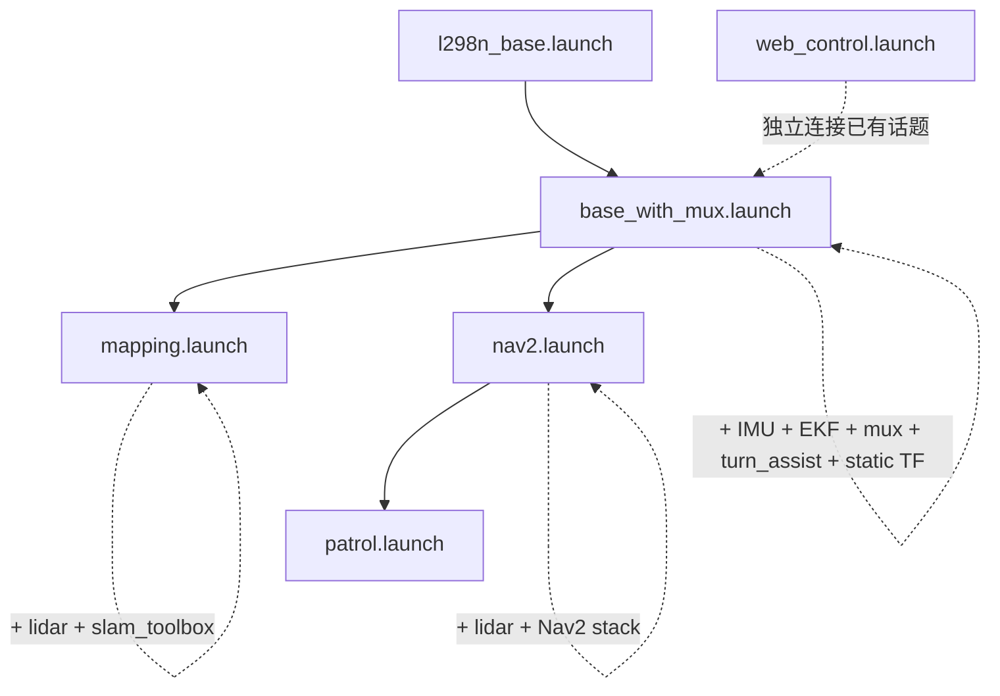

# 架构图(Mermaid 渲染)

本文件用 [Mermaid](https://mermaid.js.org/) 绘制,GitHub 会自动渲染成矢量图。
纯 ASCII 版本见 [07_diagrams.md](07_diagrams.md)。

## 系统数据流

```mermaid
flowchart TB
  subgraph SENSORS[传感器层]
    lidar[rplidar_node]
    imu[yb_mra02_uart_node]
    enc[encoder_node]
  end

  subgraph BASE[底盘层]
    odom[wheel_odometry_node]
    motor["l298n_motor_node (PID)"]
    mux[cmd_vel_mux]
    assist[turn_assist]
  end

  subgraph EST[建图 / 估计]
    ekf[robot_localization EKF]
    slam[slam_toolbox]
    amcl[amcl]
  end

  subgraph NAV[导航层]
    planner["planner (Smac Hybrid-A*)"]
    ctrl["controller (RPP)"]
    collmon[collision_monitor]
  end

  subgraph TASK[任务层]
    patrol[patrol_node]
    wall[wall_follower]
  end

  subgraph WEB[Web]
    bridge["web_cmd_bridge (Flask)"]
  end

  lidar -->|scan| slam
  lidar -->|scan| amcl
  lidar -->|scan| planner
  lidar -->|scan| ctrl
  lidar -->|scan| collmon
  lidar -->|scan| wall

  enc -->|wheel_speeds_std| motor
  enc -->|wheel_ticks_std| odom
  odom -->|odom| ekf
  imu -->|imu| ekf
  ekf -->|"TF odom→base_link"| amcl
  slam -->|"TF map→odom"| amcl

  planner --> ctrl
  ctrl -->|cmd_vel_raw| collmon
  collmon -->|cmd_vel_nav| mux
  wall -->|cmd_vel_nav| mux
  patrol -.FollowWaypoints.-> planner

  bridge -->|cmd_vel_web| assist
  assist -->|cmd_vel_web_assisted| mux
  bridge -->|cmd_vel_emergency| mux
  mux -->|cmd_vel| motor
  motor -->|PWM| wheels((车轮))
  wheels --> enc

  ekf -.位姿.-> bridge
  imu -.姿态.-> bridge
```

## TF 树

```mermaid
flowchart TB
  map --> odom
  odom --> base_link
  base_link --> laser_frame
  base_link --> imu_link

  map -.->|"slam_toolbox 建图 / amcl 导航"| odom
  odom -.->|"robot_localization EKF (唯一)"| base_link
  base_link -.->|"static 0.12,0,0.10"| laser_frame
  base_link -.->|"static 0,0,0.06"| imu_link
```

## 两层闭环控制

```mermaid
flowchart LR
  cmd["指令 v, ω"] --> split[差速分解]
  split --> target["目标轮速 L/R"]
  target --> sum(("Σ"))
  sum -->|误差| pid["PID + 前馈"]
  pid -->|PWM| l298n[L298N]
  l298n --> mot[电机]
  mot --> move[车轮转动]
  move --> encoder[编码器]
  encoder -->|实测轮速| sum
  encoder -->|ticks| wodom[wheel_odometry]
  wodom -->|odom| ekf[EKF 融合]
  imu[IMU] --> ekf
  ekf -->|"odom→base_link 位姿"| navpose["SLAM / AMCL / Nav2"]

  subgraph INNER[内层 · 控制闭环]
    sum
    pid
    l298n
    mot
    move
    encoder
  end
```

## cmd_vel 优先级仲裁

```mermaid
flowchart LR
  e["cmd_vel_emergency (255)"] --> mux{cmd_vel_mux}
  w["cmd_vel_web_assisted (100)"] --> mux
  t["cmd_vel_teleop (90)"] --> mux
  n["cmd_vel_nav (50)"] --> mux
  mux -->|"选未超时且最高优先级"| out[cmd_vel]
  out --> motor["l298n_motor_node"]
```

## 启动依赖关系

```mermaid
flowchart TB
  base[l298n_base.launch] --> bwm[base_with_mux.launch]
  bwm --> mapping[mapping.launch]
  bwm --> nav2[nav2.launch]
  nav2 --> patrol[patrol.launch]
  web[web_control.launch] -.独立连接已有话题.-> bwm

  bwm -.-> |"+ IMU + EKF + mux + turn_assist + static TF"| bwm
  mapping -.-> |"+ lidar + slam_toolbox"| mapping
  nav2 -.-> |"+ lidar + Nav2 stack"| nav2
```
